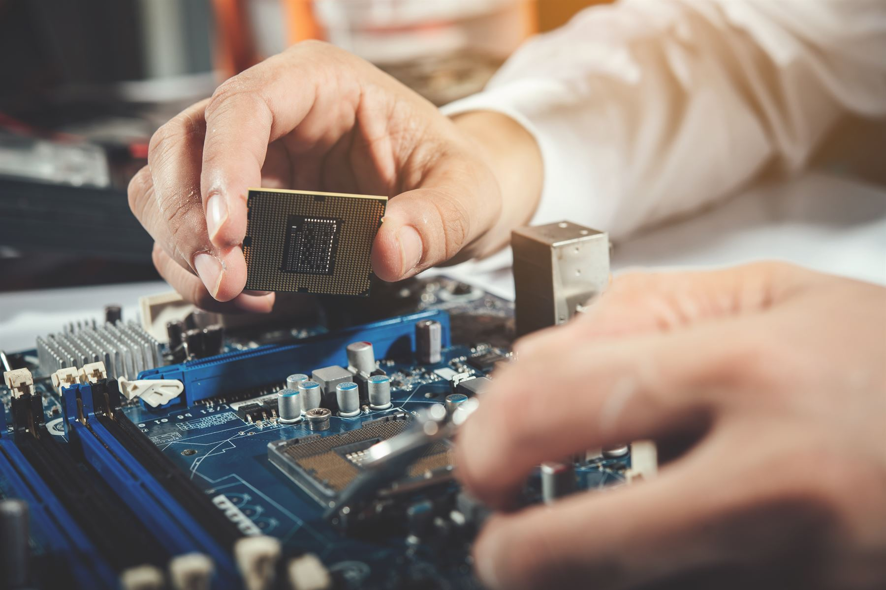
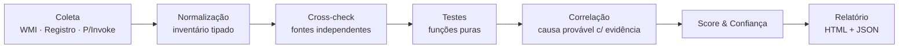

# PcDiag (TechBroswer)

**Plataforma de diagnóstico de PC e gestão de assistência técnica**

Motor de diagnóstico offline + dashboard de gestão + portal do cliente,
construídos para dar a um técnico (e ao cliente dele) uma resposta honesta
sobre o que está — e o que **não está** — comprovadamente certo com um
computador.

[Acessar o dashboard](https://tech-broswer.vercel.app/) ·
[Testar teclado](https://tech-broswer.vercel.app/ferramentas/teclado) ·
[Testar webcam](https://tech-broswer.vercel.app/ferramentas/webcam) ·
[Testar áudio](https://tech-broswer.vercel.app/ferramentas/som)

**Curtiu o projeto? Deixa uma estrela aqui em cima — isso ajuda muito!**

---

## Sobre este repositório

Este é o **repositório-vitrine (showcase)** do PcDiag: aqui está a
documentação, a visão do produto e a arquitetura em alto nível, para quem
quer conhecer o projeto, acompanhar a evolução ou só dar aquela força com
uma estrela.

> O código-fonte completo é privado (é um produto comercial em produção,
> com dados reais de clientes rodando nele). Este repo **não** contém o
> código da aplicação — só a documentação pública do projeto.

---

## O problema

Ferramentas de diagnóstico tradicionais adoram te dar um "certificado de
saúde" bonito mesmo quando não conseguiram medir metade do equipamento.
Sem elevação de administrador, sem sensor disponível, com antivírus
bloqueando alguma coisa — o resultado costuma virar "tudo OK" por padrão.

O PcDiag foi construído ao redor de uma regra simples:

> **Ausência de dado nunca vira aprovação.**

Se uma métrica não pôde ser medida, o laudo mostra isso explicitamente —
nunca aparece como "verde" por omissão.

---

## O que a plataforma entrega

### Motor de diagnóstico (C#, roda de um pendrive, sem instalar nada)

- **67 testes automatizados em 12 áreas**: CPU, memória, GPU, armazenamento,
  dispositivos/drivers, rede, segurança, bateria, eventos do Windows,
  performance e teste de carga.
- **Cross-check entre fontes independentes** para o mesmo fato (ex: núcleos
  de CPU, RAM total, saúde de disco) — quando duas fontes discordam, as
  duas leituras vão para o relatório e a confiança cai, em vez de escolher
  uma silenciosamente.
- **Confiança calculada, nunca inventada**: cada achado carrega um
  percentual derivado de uma função explícita e testada — nenhuma leitura
  de software sobre hardware de terceiro sai como 100% de certeza.
- **Teste de carga real** de CPU e GPU (código de máquina montado em tempo
  de execução, sem depender de DirectX/CUDA/OpenCL) com amostragem de
  temperatura, clock e consumo a cada segundo — a curva térmica é o que
  separa "esquentou e estabilizou" de "perdeu desempenho por superaquecer".
- **Causa provável só com evidência**: o motor de correlação nunca "chuta"
  uma causa sem lastro nos sintomas coletados.
- **Somente leitura por padrão** — nada é escrito no equipamento fora da
  pasta do próprio laudo; carga de CPU/disco exige flag explícita.
- **276 testes automatizados** garantindo a lógica de diagnóstico, rodando
  contra inventários sintéticos (sem precisar de hardware real para validar).

### Dashboard de gestão (Next.js + PostgreSQL)

- Cadastro de clientes e equipamentos com histórico completo.
- **Health Score** por equipamento com tendência histórica e alertas
  automáticos, calculados por um motor de regras determinístico (sem
  "achismo" de IA sobre saúde de hardware).
- Fila de "equipamentos que precisam de atenção" e triagem de alertas
  (Novo → Em análise → Resolvido).
- Relatórios exportáveis (resumo executivo, configuração, alertas,
  gráficos e recomendações).
- **Bancada do técnico**: check-in de equipamento com fotos de entrada,
  testes de teclado/touchpad, medições e orçamento integrado a um
  catálogo de serviços.
- **Modo Balcão**: apresentação dos achados junto com o cliente, na loja.

### Portal do cliente

- Acesso por link pessoal, **sem precisar criar conta**.
- Acompanhamento visual do reparo (recebido → em análise → aguardando
  decisão → em reparo), com "cards" de problema explicando o quê, onde e
  o quanto é urgente — em linguagem simples, sem jargão técnico.
- Fotos de evidência de cada item, com comparação antes/depois.
- Orçamento item a item: o cliente aprova ou recusa cada reparo
  individualmente, com assinatura digital.
- Chat com o técnico e contato direto por WhatsApp.

### Ferramentas públicas gratuitas

Testes rápidos de hardware direto do navegador, sem instalar nada e sem
login — pensados para quem só quer confirmar se teclado, câmera ou áudio
estão funcionando antes de levar o equipamento à assistência:

- [Teste de teclado](https://tech-broswer.vercel.app/ferramentas/teclado)
- [Teste de webcam](https://tech-broswer.vercel.app/ferramentas/webcam)
- [Teste de áudio](https://tech-broswer.vercel.app/ferramentas/som)

---

## Como o diagnóstico funciona por dentro

O motor segue um pipeline em estágios bem separados — cada peça só faz uma
coisa, o que permite testar a lógica de diagnóstico inteira sem precisar
de hardware real:

Regra dura do projeto: **um Collector nunca decide status; um Test nunca
toca o sistema operacional.** Isso é o que torna a suíte de testes
determinística e independente de hardware físico.

---

## Stack técnica

| Camada | Tecnologias |
|---|---|
| Motor de diagnóstico | C# sobre .NET (compila só com o `csc.exe` nativo do Windows — sem SDK, sem MSBuild) |
| Sensores de hardware | LibreHardwareMonitorLib, WMI, APIs nativas do Windows |
| Dashboard / API | Next.js 14 (App Router), React 18, TypeScript |
| Dados | PostgreSQL + Prisma ORM |
| UI | Tailwind CSS |
| Validação | Zod |
| Autenticação | JWT (jose) + bcrypt, RBAC (Admin/Operador) |
| Testes | Vitest (dashboard) · suíte própria (motor de diagnóstico) |
| Deploy | Vercel (com cron jobs agendados) |

---

## Segurança e privacidade por padrão

- O motor de diagnóstico **não coleta senha, token, cookie, histórico de
  navegação ou conteúdo de arquivo** — só telemetria de hardware/sistema.
- Flag `--privacy-safe` mascara serial, hostname, usuário, MAC e IP no
  laudo.
- Processos externos chamados por allowlist fixo e caminho absoluto (sem
  shell) — fecha injeção de comando e sequestro de PATH.
- Cabeçalhos de segurança aplicados em todas as respostas do dashboard.

---

## Gostou?

Esse projeto nasceu para resolver um problema real de assistências
técnicas: dar um diagnóstico **honesto**, e não só bonito. Se a ideia fez
sentido pra você, deixa uma estrela no repositório — isso ajuda o projeto
a ser descoberto por mais gente.

Feito por [**Gusmares**](https://github.com/Gusmares).

---

Este repositório contém apenas documentação e materiais públicos do
projeto. O código-fonte da aplicação é privado.
